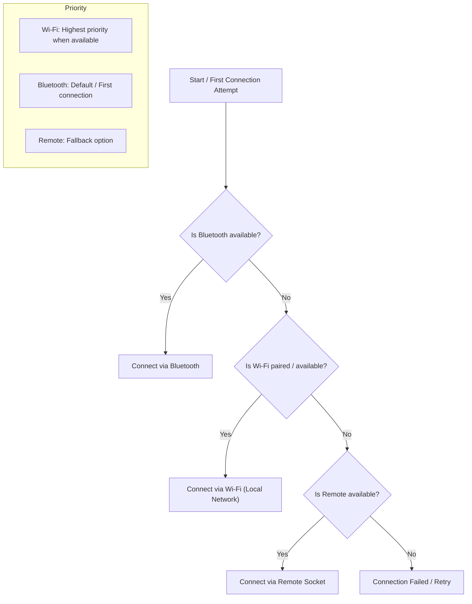

# OpenVibe 🍆 (WIP)

An open-source vibrator control application built with modern web technologies. OpenVibe provides an intuitive interface for device control with beautiful animations and seamless Bluetooth connectivity.

### Figma design
https://www.figma.com/design/Xa1an0qJLjdy5ySqEZhvHy/OpenVibe?node-id=0-1&p=f&t=YQwxmkSbwiMUBQeC-0

## ✨ Features

- **Bluetooth LE Integration**: Scan and connect to Bluetooth devices
- **Liquid Gauge Animation**: Smooth animated percentage display
- **Responsive Design**: Works on mobile and desktop
- **Modern UI**: Clean interface with Tailwind CSS

## 🛠️ Tech Stack

- **Vue 3** with Composition API
- **TypeScript** for type safety
- **Vite** for fast development
- **Tailwind CSS** for styling
- **Capacitor Community Bluetooth LE** for device connectivity

## 🚀 Quick Start

```bash
# Clone and install
git clone https://github.com/yourusername/openvibe.git
cd openvibe
npm install

# Start development
npm run dev
```

## Transport Selection



## 📄 License

MIT License - see [LICENSE](LICENSE) for details.

---

*Educational project - ensure compliance with local regulations.*